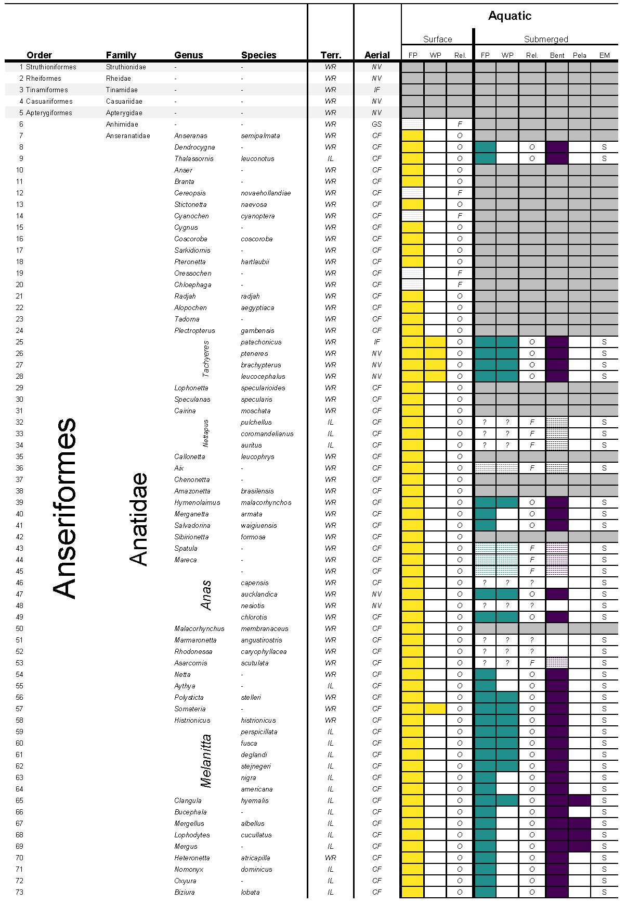
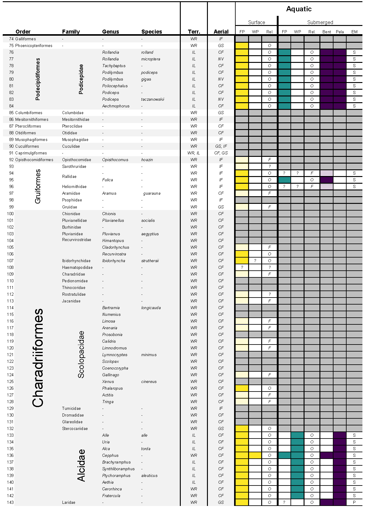
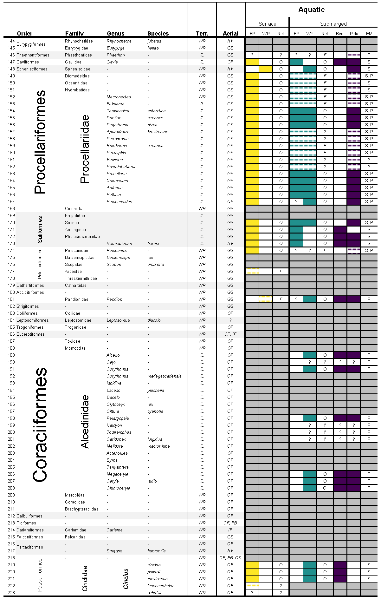

# Lapsansky_Warrick_Tobalske_2022
I noticed the other day that I had trouble accessing my own paper and the associated data through my university portal. To make those data more accessible, this page will serve as a secondary repository for data related to the paper "High Wing-Loading Correlates with Dive Performance in Birds, Suggesting a Strategy to Reduce Buoyancy", published in Integrative and Comparative Biology. If you use the data, please cite the paper. And if you have any questions or want to collaborate, let me know!

## Abstract

Diving birds are regarded as a classic example of morphological convergence. Divers tend to have small wings extending from rotund bodies, requiring many volant species to fly with rapid wingbeats, and rendering others flightless. The high wing-loading of diving birds is frequently associated with the challenge of using forelimbs adapted for flight for locomotion in a “draggier” fluid, but this does not explain why species that rely exclusively on their feet to dive should have relatively small wings, as well. Therefore, others have hypothesized that ecological factors shared by wing-propelled and foot-propelled diving birds drive the evolution of high wing-loading. Following a reexamination of the aquatic habits of birds, we tested between hypotheses seeking to explain high wing-loading in divers using new comparative data and phylogenetically informed analyses. We found little evidence that wing-propelled diving selects for small wings, as wing-propelled and foot-propelled species share similar wing-loadings. Instead, our results suggest that selection to reduce buoyancy has driven high wing-loading in divers, offering insights for the development of bird-like aquatic robots.

Below is the table that took the most work of anything. An exhaustive (and exhausting) review of the aquatic habits of birds. I viewed thousands of hours of videos and tons of images to determine how each species interacts with water. More details can be found in the attached paper and supplemental. Hopefully, this will help someone with their work! 

## Table S3
All orders of birds are considered with increased resolution to family, genera, and species levels where variation in aquatic behavior exists. The terrestrial (Terr.) habits of each group are categorized as either WR (walking/running) or IL (infrequent/labored). The aerial (Aerial) habits of each group are categorized as NV (non-volant), IF (infrequent flight), GS (gliding/soaring + flapping), CF (continuous flapping), or FB (flap-bounding). For both surface and submerged aquatic habits, the use of an appendage pair (FP – foot-propelled, WP – wing-propelled) for steady-state aquatic propulsion is indicated by a colored rectangle corresponding to that group. Colors (yellow, teal, and purple) are to ease visualization only. Gray rectangles indicate a lack of aquatic locomotion (surface or submerged) for that row. All diving and swimming groups are categorized according to their reliance on aquatic locomotion (Rel.) as either O (obligate; solid filled rectangles) or F (facultative; diagonal striped rectangles). In reliance columns, “?” indicates unknown reliance (sensu Ashmole 1971). In wing-propelled and foot-propelled columns, “?” indicates that the appendage pair may utilized for aquatic locomotion, but that concrete evidence is lacking. Taxonomic organization follows that of Birds of the World (Billerman et al. 2020).

